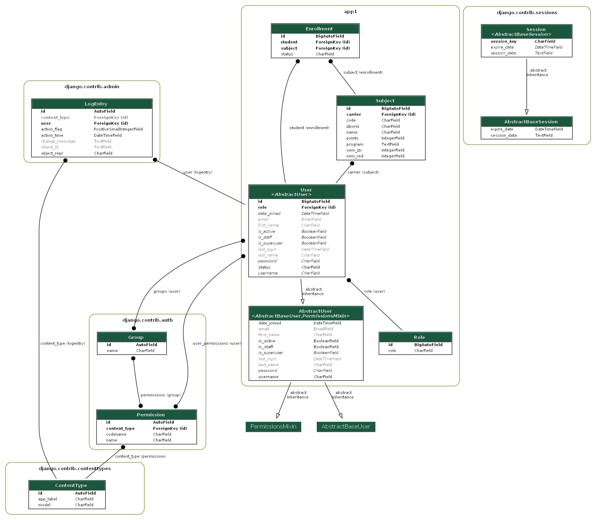

# MarkeTour

## General info

This is a Student Management System web application developed using Django, a Python web framework. It provides functionality for managing students, professors, and courses within an educational institution.

## Table of Contents

- [General info](#general-info)
- [Features](#features)
- [Database Model](#database-model)
- [Tech stack](#tech-stack)
- [Authors](#authors)

## Features

<li>Supports three roles: admin, professor and student.

<li>Admin can add(register) new users.

<li>Admin can edit and/or delete other users and can edit/add new subjects.

<li>Professor can add new subjects and change grades for students where the professor is the carier for the subject.

<li>Students can see all of the subjects and enroll in each one.

<li>Once a student is enrolled in a subject, he can drop out only based on a certain grade.

<li>Depending on the user role, certain site features are restricted.

</li>

  

## Database Model

## Tech stack

* Django(Python)
* HTML, CSS, JS

## Authors

| Name          | Github                                   |
|---------------|------------------------------------------|
| Jakov Soldić  | [GitHub](https://github.com/JakovSoldic) |

